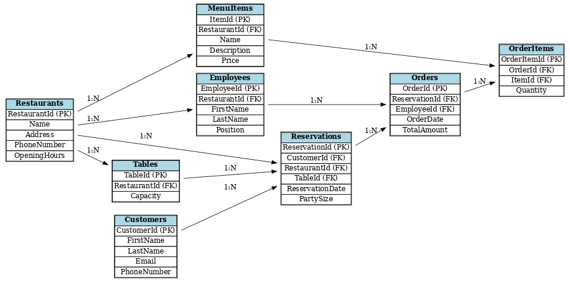

# Restaurant Reservation Database Project

## Overview
This project implements a SQL Server database to manage restaurant operations, including reservations, orders, menu items, employees, and customers.  
It provides querying capabilities, stored procedures, functions, triggers, and performance optimization using indexing and query plans.

---

## Schema

### Tables
| Table        | Primary Key   | Foreign Keys                      | Description|
|-------       |-------------  |-------------                      |-------------|
| Restaurants  | RestaurantId  | -                                 | Stores restaurant information |
| MenuItems    | ItemId        | RestaurantId                      | Stores menu items for each restaurant |
| Orders       | OrderId       | ReservationId, EmployeeId         | Stores orders placed by customers |
| OrderItems   | OrderItemId   | OrderId, ItemId                   | Stores items associated with each order |
| Employees    | EmployeeId    | RestaurantId                      | Stores employee details |
| Reservations | ReservationId | CustomerId, RestaurantId, TableId | Stores table reservations |
| Customers    | CustomerId    | -                                 | Stores customer information |
| Tables       | TableId       | RestaurantId                      | Stores restaurant tables and capacities |
| AuditLog     | LogId         | RestaurantId, TableId             | Stores audit information for table reservations |

### ERD
Include your ERD diagram here as an image (`Restaurant_Reservation_ERD.png`) showing entities, relationships, PKs, and FKs.

---

## Data Seeding
- Populate tables with sample data:
  - 50 Restaurants
  - 1000 MenuItems
  - 1500 OrderItems
  - 500 Orders
  - 100 Employees
  - 500 Reservations
  - 400 Customers
  - 100 Tables
- Data generation: used scripts to ensure consistency and meaningful relationships.  
- Seed scripts are in `SeedGeneratorUnique.java`.
-- Each MenuItem assigned to a Restaurant.
- Reservations linked to existing Customers and Tables.
- Orders linked to existing Reservations and Employees.
---

## Queries
All queries are start with `query`:

1. **List of Reservations**: Retrieve all reservations for a specific customer.  
2. **List of Managers**: Retrieve employees holding `Manager` position.  
3. **Orders with Menu Items**: Retrieve orders for a specific reservation along with associated menu items.  
4. **Ordered Menu Items**: List menu items ordered in a specific reservation.  
5. **Average Order Amount**: Calculate average order amount per employee.  
6. **Reservations Report (View)**: List reservations with restaurant and customer info.  
7. **Employees Details (View)**: List employees with their restaurant info.  
8. **Reservations with 2+ Orders (CTE)**: Identify reservations with multiple orders.  
9. **Restaurant Popularity (Aggregation)**: Rank restaurants by reservation frequency.  
10. **Popular Menu Item Analysis (Join + Window)**: Identify most popular menu item per restaurant for a given month.  

---

## Functions
All functions are start with `fn`:

- **fn_CalculateRevenue(RestaurantId)**: Returns total revenue for a restaurant.  
- **fn_CalculateEmployeeSalary(EmployeeId)**: Returns salary based on number of orders and employee rank.  

---

## Stored Procedures
All procedures are start with `sp`:

- **sp_ResrvedTablesReport(StartDate, EndDate)**: Returns tables reserved within a date range.  
- **sp_AddNewOrder(ReservationId, EmployeeId, OrderDate, TotalAmount)**: Adds a new order with validation.  
- **Procedure with Temp Table**: Retrieves future reserved tables and joins with restaurants.  

---

## Triggers
All triggers are start with `trigger`:

- **trg_AuditReservation**: Logs new reservations into `AuditLog` with `RestaurantId`, `TableId`, `ReservationDate`, `ChangeDate`.

---

## Indexing & Query Plans
- Added indexes on columns frequently used in `WHERE`, `JOIN`, and `ORDER BY`:
  - `Orders.EmployeeId`
  - `Reservations.RestaurantId`
  - `OrderItems.ItemId`
- Execution plan analysis:
  - **Part 1**: Checked 5 complex queries before adding indexes.  
  - **Part 2**: Checked the same queries after adding indexes to see performance improvement (Table Scan → Index Seek).
